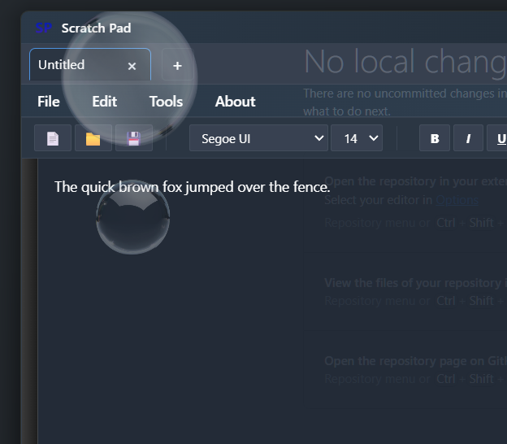
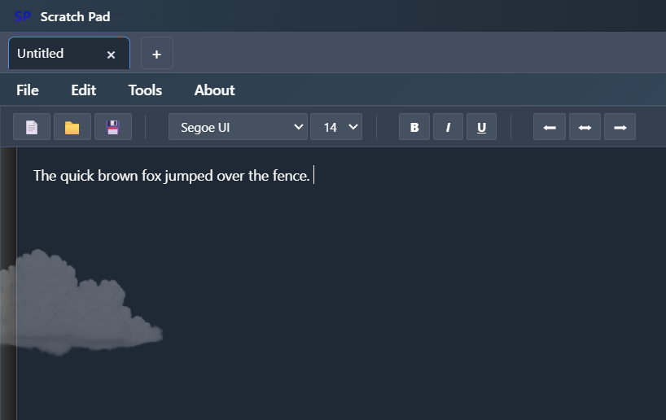

# Scratch Pad - A Privacy Focused Word Processor

A word processor designed specifically for professional environments, offering both fast general-purpose editing and secure encrypted document handling.

---

## 📋 Table of Contents
- [Perfect for Healthcare](#-perfect-for-healthcare)
- [Getting Started](#-getting-started)
- [Current Features](#-current-features)
- [Target Use Cases](#-target-use-cases)
- [Key Benefits](#️-key-benefits)
- [Architecture Overview](#️-architecture-overview)
- [Screenshots](#-screenshots)
- [System Requirements](#system-requirements)
- [Security Notice](#-security-notice)

---

## 🏥 Perfect for Healthcare
> Scratch Pad is intuitive enough for anyone — from the front desk reception to administrative staff. A custom word processor designed for everyday workflow, with an option of privacy-first features ready if you need them.

---

## 🚀 Getting Started

### Quick Download
**[📥 Download Scratch Pad.exe](https://github.com/Fingersoup/Scratch-Pad/blob/main/Scratch%20Pad.exe)**
> Version 1.0.0b — Friends & Family Edition

### Installation Steps
1. Click the download link above
2. Click "Download" on the GitHub page
3. Launch Scratch Pad.exe
4. Configure your settings as needed

> **Note:** Windows may show a security warning for unsigned software. This is normal for new applications.

---

**🆓 Absolutely free to use** — no subscriptions, no telemetry, no data mining, no annoying ads, and zero tracking. Third-party libraries are handpicked with privacy in mind. Feel free to audit! 🗽🦅

## 🆕 Current Features
### General Mode (*Mostly Ready Now)
- **Modern Dark UI** with MaterialDesign styling and opacity toggle
- **Multiple File Formats** - .txt, .rtf, .md, .docx support
- **Smart Features** - Auto-save, spell check, find/replace, undo/redo
- **Print Support** with proper formatting
- **Recent Files** management
- **Bubbles and Clouds** - Relaxing backgrounds for working (Don't try to run both UI effects without a decent GPU!)
- **Customizable Settings** - fonts, word wrap, opacity, auto-clear clipboard
- **No Telemetry** - completely private, local-only file operation
- **Password-Protected Access** - secure login to encrypted documents
- **AES File Encryption** - military-grade encryption for sensitive documents saved as a custom *.secx format
- **Visual Security Indicators** - clear UI showing when in secure mode
- **File Integrity Verification** - ensures documents haven't been tampered with

## 🎯 Target Use Cases
- **HR Documents** - Employee reviews, disciplinary actions, salary negotiations
- **Financial Planning** - Budget discussions, cost analysis, vendor negotiations
- **Internal Communications** - Sensitive memos, policy drafts, meeting notes
- **Compliance Documentation** - Internal audits, process improvements
- **Vendor Contracts** - Negotiations, terms discussions, pricing analysis

## 🗝️ Key Benefits
- ✅ **HIPAA-Adjacent Compliance** (for non-ePHI administrative documents)
- ✅ **Zero Vendor Lock-in** - all files stored locally
- ✅ **No Subscription Fees** - no ongoing costs
- ✅ **Privacy-First Design** - no analytics, no cloud dependencies
- ✅ **IT-Friendly** - minimal installation, no network requirements

## 🏗️ Architecture Overview
### Current Stack
- **Framework:** WPF with .NET 6 LTS
- **UI Library:** MaterialDesignInXamlToolkit
- **Pattern:** MVVM with CommunityToolkit.Mvvm
- **File Handling:** DocumentFormat.OpenXml for .docx support
### Security Stack
- **Encryption:** AES-256-GCM for authenticated encryption
- **Key Derivation:** PBKDF2 with high iteration count
- **File Format:** Custom binary format with encrypted content + metadata
### Security Best Practices
- **No Key Storage** - Passwords never stored, only derived keys in memory
- **Secure Memory** - Sensitive data cleared from memory after use

---

## 📸 Screenshots

### UI Effects
Experience a calming work environment with optional visual effects:

| Bubbles Effect | Clouds Effect |
|:---:|:---:|
|  |  |
| Relaxing bubble animation overlay | Gentle cloud background animation |

> **Performance Note:** Don't try to run both UI effects simultaneously without a decent GPU!

---

### System Requirements
- Windows 10/11
- .NET 6 Runtime
- 50MB disk space
- 512MB RAM minimum

---

## 🛡️ Security Notice

### Antivirus Detection
This application is **unsigned software**, which may trigger warnings from some antivirus programs. This is a common occurrence for new, independent software and does not indicate malicious content.

**Why this happens:**
- The application lacks a code signing certificate (expensive for individual developers)
- Some antivirus engines are overly cautious with unsigned executables
- This is a **false positive**, not actual malware

**What you can do:**
- Review the source code (this repository is open for inspection)
- Run the application in a sandboxed environment if concerned
- Check the file hash against releases to verify integrity

### Privacy Commitment
- **No telemetry** - Zero data collection
- **Local-only** - No network connections required for document processing
- **Open source approach** - Code available for security review

---

## 📄 License

This software is provided free of charge for personal and professional use.

---

## 🤝 Contributing

This is currently a personal project, but feedback and suggestions are welcome! Feel free to:
- Open issues for bug reports
- Suggest features
- Share your use cases

---

## 📧 Contact

For questions or feedback, please use GitHub Issues.

---

  <strong>Built with ❤️ for privacy-conscious professionals</strong>

